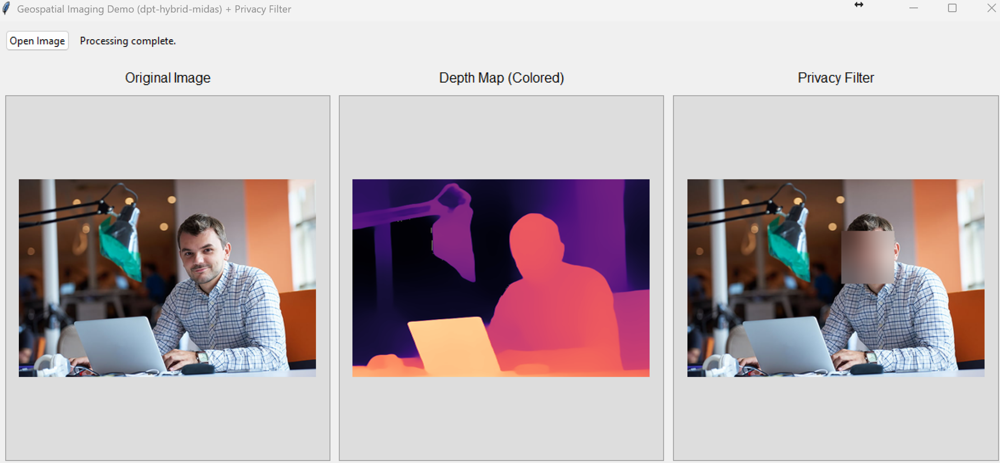

# Crowd Sourced Geospatial Imaging with NeRF-Based 3D Scene Generation
For CECS 574 Distributed Computing - Spring 2025 by Hasala Senevirathne

This repository contains followubg Python utilities:

* **IMU‑Assisted Structure‑from‑Motion** (`sfm_mobile.py`)
* **GeoSpatial Imaging Demo** (`GeoSpatialDemo.py`)

---

## 1  IMU‑Assisted Structure‑from‑Motion  
`sfm_mobile.py`

### Overview
Reconstruct a **sparse 3‑D point cloud** and camera poses from a set of overlapping photographs, _optionally_ enhanced with per‑image IMU orientation / position data.  
The script outputs COLMAP‑compatible `cameras.txt`, `images.txt`, and `points3D.txt` files that can be used for dense reconstruction or NeRF training.

### Requirements
| Package | Tested version |
|---------|---------------|
| Python  | ≥ 3.8 |
| NumPy   | 1.26 |
| SciPy   | 1.12 |
| OpenCV (+ contrib modules) | 4.10 |
| tqdm    | 4.66 |

### Installation
```bash
# create & activate a virtual environment (optional but recommended)
python -m venv venv
# Win
venv\Scripts\activate
# macOS / Linux
source venv/bin/activate

python -m pip install --upgrade pip
python -m pip install numpy scipy tqdm
python -m pip install --extra-index-url https://artifacts.opencv.org/opencv-python/ opencv-contrib-python
```

### Project layout
```text
project_root/
├─ sfm_mobile.py          # SfM pipeline
├─ data/
│  ├─ images/             # input .jpg / .png
│  └─ imu.json            # optional IMU data
└─ output/                # written automatically
```
`data/imu.json` example:
```json
{
  "0001.jpg": {
    "rotation": [roll, pitch, yaw],  // degrees (XYZ)
    "position": [x, y, z],           // metres or any unit
    "timestamp": 0.00
  }
}
```
### Run
```bash
python sfm_mobile.py   --image_dir data/images   --imu_json  data/imu.json   --output_dir output
```

### Output files
| File | Description |
|------|-------------|
| `cameras.txt` | Intrinsics per image (SIMPLE_PINHOLE). |
| `images.txt`  | Camera extrinsics + quaternion. |
| `points3D.txt`| Sparse 3‑D points & tracks. |

Import the TXT model in **COLMAP** or any compatible viewer.

---

## 2  GeoSpatial Imaging Demo  
`GeoSpatialDemo.py` 


### Features
* Tkinter GUI to load an image.
* Depth estimation with **Intel DPT‑Hybrid (MiDaS Small 2.1)** via `transformers`.
* Coloured depth‑map visualization.
* Privacy filter: Gaussian‑blur faces & licence plates (OpenCV Haar cascades).

### Dependencies
| Package | Purpose |
|---------|---------|
| `torch` (CPU) | Run the depth network |
| `transformers` | Load the MiDaS checkpoint |
| `Pillow` | Image handling for Tkinter |
| `opencv-python` | Colormaps + Haar cascades |
| `tkinter` | Built‑in GUI toolkit |

#### Install
```bash
python -m venv venv
venv\Scripts\activate  # Windows — or source venv/bin/activate on mac/Linux

python -m pip install --upgrade pip
python -m pip install torch torchvision --index-url https://download.pytorch.org/whl/cpu
python -m pip install transformers pillow opencv-python
```

### Run
```bash
python GeoSpatialDemo.py
```
On first launch the MiDaS weights (~335 MB) and cascades are downloaded.  
After the status bar shows **“Model loaded”**, click **Open Image** to view:
1. Original image
2. Coloured depth map
3. Privacy‑filtered result

### Folder structure
```text
project_root/
├─ GeoSpatialDemo.py
```
---

## License
MIT
